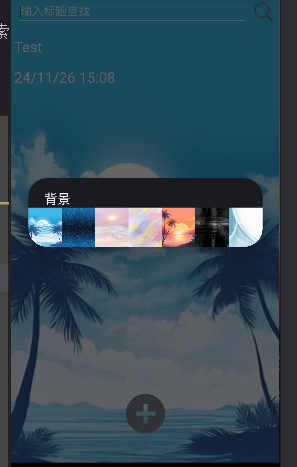
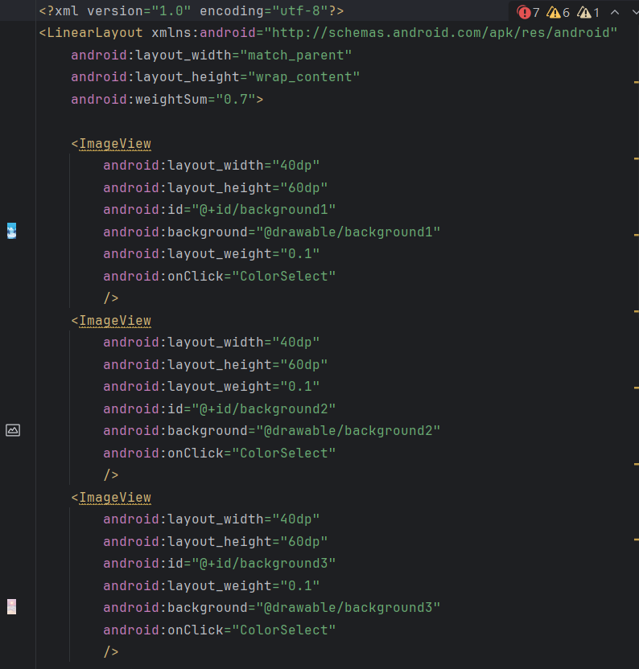
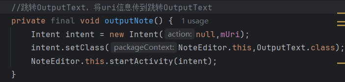

***一、项目简介***
    项目名称：Android简易记事本APP
    项目功能：新建笔记、编辑笔记、删除笔记、搜索笔记等
    项目语言：Java
    项目平台：Android Studio
    项目作者：121052022042 软工一班 钟灵毓秀
***二、项目部署***
    1.下载项目压缩包
    2.解压项目压缩包
    3.打开Android Studio
    4.选择Open an existing project
    5.选择解压后的项目文件夹
    6.等待项目加载完成
    7.运行项目
    8.选择模拟器运行APP
*注：本项目使用JDK1.8   GRADLE 6.7.1   Android SDK 23*
***三、项目功能***
    **以下为基本功能：**
    *1.添加时间戳*
        功能说明：当用户新建笔记时，系统会自动添加当前时间戳
        功能展示：
        代码思路说明与代码截图：
                    1.时间戳应该在NotePad主页面的每个笔记列表项中添加，所以在res—layout—notelist_item.xml布局文件中添加TextView  
                    2.在NoteList的PROJECTION中添加COLUMN_NAME_MODIFICATION_DATE字段
                    3.修改适配器内容，在NoteList增加dataColumns中装配到ListView的内容，同时增加一个ID标识来存放该时间参数  
                    4.在NoteEditor的updateNote方法中获取当前系统的时间，并对时间进行格式化  
    *2.添加搜索功能*
        功能说明：点击搜索图标，输入关键字，系统会自动搜索笔记内容中包含该关键字的笔记，并显示搜索结果
        功能展示：
        代码思路说明与代码截图：
                    1.搜索组件在主页面的菜单选项中，所以在res—menu—list_options_menu.xml布局文件中添加搜索功能，新增menu_search.xml布局文件 
                    2.在res—layout中新建note_search.xml用于查找笔记内容  
                    3.在NoteList中的onOptionsItemSelected方法中新增search查询的处理  
                    4.新建一个NoteSearch类用于search功能的功能实现  
    **以下为扩展功能：**
    *3.UI美化*
        功能说明：添加修改背景主题与UI界面美化等效果
        功能展示：
        代码思路说明与代码截图：
                    1.在NoteList新增方法showpopSelectBgWindows用于弹出选择背景主题的窗口  
                    2.在NoteList新增方法ColorSelect用于背景主题监听   
                    3.在res—layout内新建dialog_bg_select_layout.xml用于选择背景主题的窗口布局  
                    4.更改NoteList的OnCreate方法  
                    5.在res-drawable内添加7张背景图命名为background1~7
    *4.记事本的偏好设置*
        功能说明：主页添加“Settings”菜单项，点击出现设置页面
        功能展示：
        代码思路说明与代码截图：
                    1.在res—menu—list_options_menu.xml中添加Settings菜单项  
                    2.新建NoteSettings类，使用AndroidX库  
                    2.在NoteList的onOptionsItemSelected方法处理菜单项点击  
                    3.设置各开关的功能  
                    4.在AndroidManifest注册NoteSettings类  
    *5.导出笔记*
        功能说明：笔记详情页添加“导出”菜单栏，点击可保存至手机的文件中，可在文件资源管理内查看
        功能展示：
        代码思路说明与代码截图：
                    1.在res—menu—editor_options_menu.xml中添加Output菜单项
                    2.在NoteEditor的onOptionsItemSelected方法处理菜单项点击
                    3.在NoteEditor中添加函数outputNote用于跳转导出
                    4.在res—layout中新增output_text.xml设置导出界面
                    5.新建OutputText类用于读取笔记信息并导出
                    6.在AndroidManifest注册OutputText类并定义为对话框样式
                    7.在AndroidManifest中添加在SD卡中创建与删除文件权限和在SD卡中写入数据（需放在<application>标签外）
    *6.笔记排序*
        功能说明：在主页菜单栏添加排序图标，点击可按“创建时间”或“修改时间”对笔记进行排序
        功能展示：
        代码思路说明与代码截图：
                    1.在res—menu—list_options_menu.xml中添加Sort菜单项
                    2.在NoteList的onOptionsItemSelected方法处理菜单项点击

    